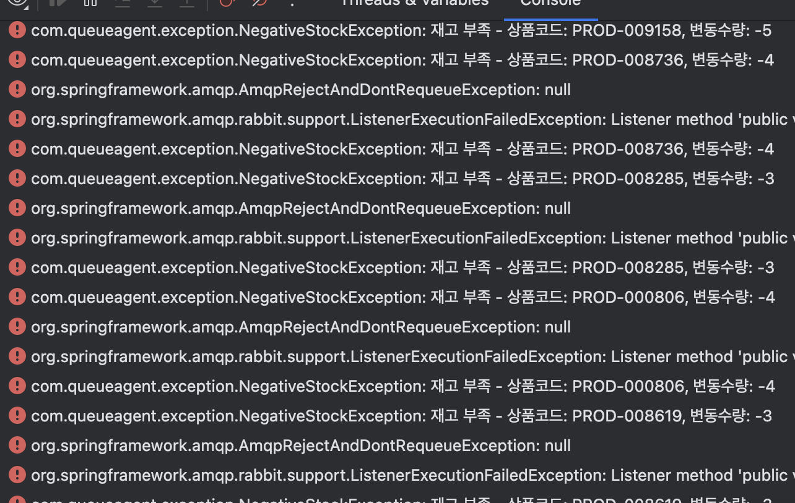
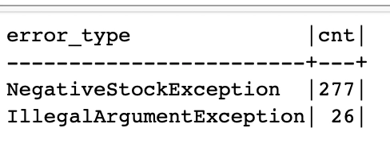
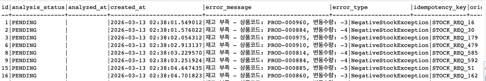
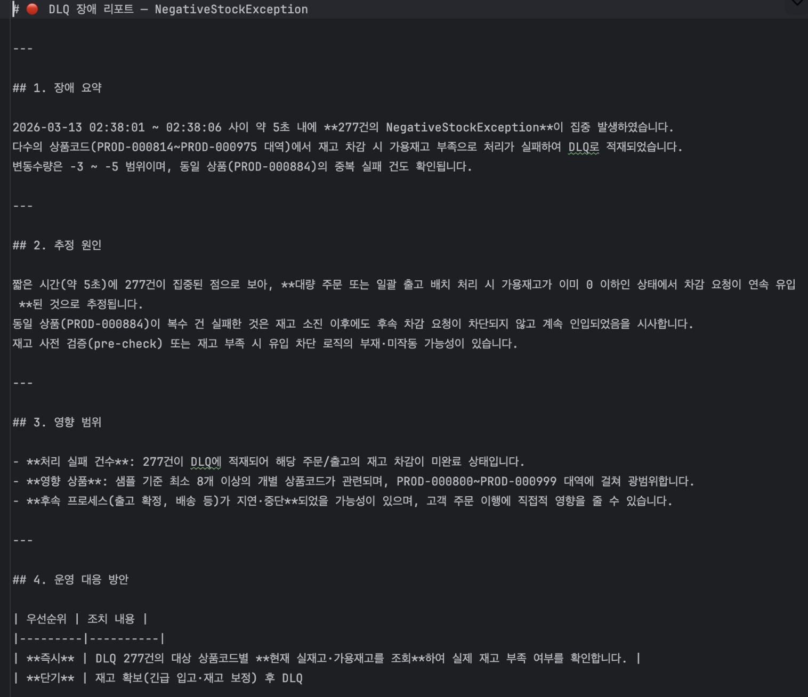
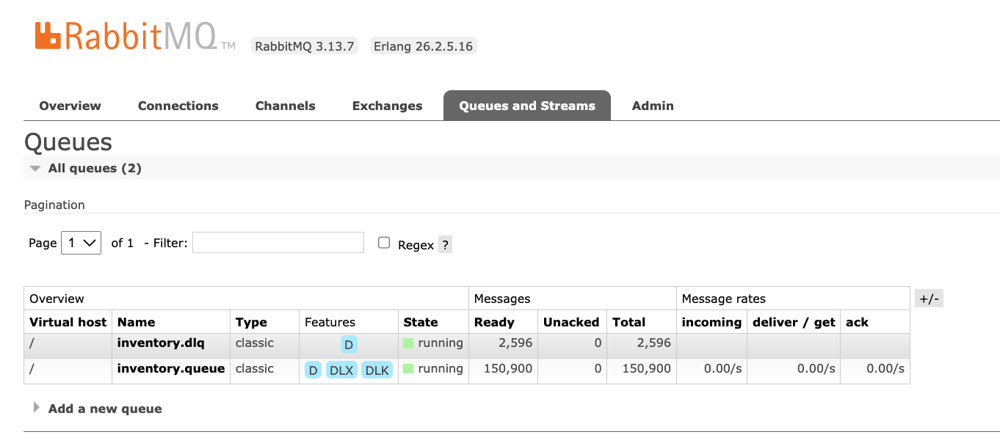

# 대규모 재고 이벤트 처리 및 AI 지능형 장애 대응 파이프라인

WMS/OMS 환경에서 **대규모 재고 이벤트를 안정적으로 처리**하고,
장애 발생 시 시스템 스스로 원인을 진단하는 **AI 지능형 파이프라인**을 구현한 프로젝트입니다.

---

## 프로젝트 개요

대규모 거래 환경에서는 두 가지 핵심 과제가 존재합니다.

1. **처리 안정성** — 메시지 유실 없이 중복 및 음수 재고를 원천 차단
2. **장애 대응** — 실패 이벤트를 자동 격리하고, AI가 원인을 진단해 운영 대응 방안까지 제시

본 프로젝트는 Transactional Outbox 패턴, 이중 멱등성 방어, DLQ 파이프라인, Claude Opus 기반 AI 분석을 결합해 이 두 과제를 해결합니다.

---

## 기술 스택

| 영역 | 기술 |
|---|---|
| **Backend** | Java 21, Spring Boot 3.2.5, JPA |
| **Infrastructure** | Docker, MySQL 8.0, RabbitMQ |
| **Messaging** | Transactional Outbox Pattern, RabbitMQ DLX/DLQ |
| **AI/ML** | Claude Opus (Anthropic Java SDK 2.15.0), RAG (계획) |

---

## 주요 기능

| 기능 | 설명 |
|---|---|
| **Transactional Outbox** | DB 선저장 후 1,000건 청크 단위 MQ 발행으로 Zero Loss 보장 |
| **이중 멱등성 방어** | 사전 조회 + unique 제약 선점으로 찰나의 중복 요청까지 차단 |
| **원자적 재고 업데이트** | `WHERE currentQuantity + quantity >= 0` 조건으로 DB 레벨 음수 방지 |
| **지수적 백오프 재시도** | 3회 재시도(1s → 2s → 4s)로 일시적 오류 자동 복구 |
| **DLQ 격리** | 재시도 소진 후 실패 이벤트를 DB에 저장하여 안전하게 보관 |
| **AI 장애 분석** | Claude Opus가 DLQ 이벤트를 errorType별 집계 후 장애 리포트 자동 생성 |

---

## 아키텍처

```
[OMS / 외부 시스템]
        │
        │ 재고 변경 요청
        ▼
┌─────────────────────┐
│  temp_stock_request  │  ← 임시 요청 버퍼 (처리 전 선저장)
└─────────────────────┘
        │ StockRequestScheduler (1초 주기, 1,000건 청크)
        ▼
┌──────────────────────────────────┐
│        InventoryService           │
│  Outbox 생성 + 재고 원장 업데이트  │
└──────────────────────────────────┘
        │
        ▼
┌─────────────────────┐
│  inventory_outbox    │  ← PENDING 상태로 저장 (Outbox 패턴)
└─────────────────────┘
        │ OutboxPublisherScheduler (1초 주기, 1,000건 청크)
        ▼
┌──────────────────────────────┐
│  RabbitMQ inventory.exchange  │
│  → inventory.queue            │
└──────────────────────────────┘
        │ InventoryConsumer (concurrency 5~10, prefetch 50)
        ▼
┌──────────────────────────────────────┐
│      InventoryConsumerService         │
│  1. 멱등성 선점 (processed_messages)  │
│  2. 원자적 재고 업데이트              │
│  3. NegativeStockException 격리       │
└──────────────────────────────────────┘
        │ 처리 실패 → 재시도 3회 (지수 백오프)
        ▼
┌─────────────────────┐
│    inventory.dlq     │  ← 진짜 장애만 도달
└─────────────────────┘
        │ DlqConsumer → DlqEvent DB 저장
        ▼
┌─────────────────────┐
│     dlq_event        │  ← 에러 유형, 메시지, 원본 페이로드 기록
└─────────────────────┘
        │ DlqAnalysisScheduler (5분 주기)
        ▼
┌──────────────────────────────────┐
│   AiIncidentAnalyzerService       │
│   Claude Opus Streaming 호출      │
└──────────────────────────────────┘
        │
        ▼
  AI 장애 리포트 생성
  (장애 요약 / 추정 원인 / 영향 범위 / 운영 대응 방안)
```

---

## 설계 상세

### ① 대용량 처리 설계

- **테스트 모수**: 1만 개 상품 마스터 × 약 2.5만 건 재고 이벤트로 성공/실패 비율 및 DLQ 이동 패턴 검증
- **청크 처리**: 스케줄러가 1,000건 단위로 읽어 처리 — 메모리 과부하 방지
- **Producer/Publisher 분리**: INSERT(temp_stock_request → outbox)와 SELECT&PUBLISH(outbox → MQ) 작업을 별도 스케줄러로 분리해 I/O 간섭 최소화

### ② 이중 멱등성 방어

```
요청 도착
  │
  ├─ [1차] existsById() 조회 → 이미 처리됨 → 즉시 종료
  │
  └─ [2차] saveAndFlush() → DataIntegrityViolationException 캐치
                           → 동시 중복 요청도 차단
```

- 일반적인 중복: 1차 방어(조회)에서 종료
- 찰나의 동시 요청: 2차 방어(unique 제약)에서 차단
- DLQ 재시도 중 중복 저장: `idempotencyKey` unique 제약으로 무시

### ③ 원자적 재고 업데이트

```sql
UPDATE product_stock
SET current_quantity = current_quantity + :quantity,
    updated_at = :now
WHERE product_code = :productCode
  AND current_quantity + :quantity >= 0
```

- 음수 재고 방지를 애플리케이션이 아닌 **DB 레벨**에서 처리
- 업데이트 결과 0건 → `NegativeStockException` 발생 → DLQ 라우팅

### ④ DLQ 파이프라인

```
실패 발생
  → 재시도 1회 (1초 후)
  → 재시도 2회 (2초 후)
  → 재시도 3회 (4초 후)
  → inventory.dlq 라우팅
  → DlqEvent DB 저장 (errorType, errorMessage, originalPayload)
```

**▼ 재시도 소진 후 NegativeStockException → DLQ 라우팅 로그**



실패 이벤트는 `dlq_event` 테이블에 errorType별로 저장되며, AI 분석 스케줄러가 이를 집계해 분석합니다.

**▼ dlq_event 테이블 — errorType별 발생 건수**



**▼ dlq_event 테이블 — 그룹별 샘플 데이터**



### ⑤ AI 장애 분석

5분마다 PENDING 상태의 DLQ 이벤트를 errorType별로 집계하고, 대표 샘플 10건을 Claude Opus에 전달합니다.

**생성되는 리포트 형식:**
1. 장애 요약
2. 추정 원인
3. 영향 범위
4. 운영 대응 방안

**▼ Claude Opus가 생성한 실제 장애 분석 리포트**



---

## 설계 의사결정 근거

### Q. 왜 1,000건 단위 청크 처리인가?

자체 메모리 사용량 테스트 결과를 기반으로 결정했습니다.

| 청크 사이즈 | 처리 속도 | 메모리 안정성 |
|---|---|---|
| 500건 | 느림 | 안정 |
| **1,000건** | **최적** | **안정** |
| 2,000건 | 빠름 | 불안정 |

또한 `@Transactional(REQUIRES_NEW)`로 각 청크를 독립 트랜잭션으로 격리해,
특정 청크 실패가 전체 처리 건수의 롤백으로 이어지는 리스크를 차단했습니다.

### Q. 왜 애플리케이션이 아닌 DB 레벨에서 음수 재고를 체크하는가?

애플리케이션에서 조회 후 수정하는 방식은 **조회와 수정 사이의 찰나에 재고가 변동되는 Race Condition**이 발생합니다.

```sql
-- 조회와 수정을 하나의 쿼리로 처리
UPDATE product_stock
SET current_quantity = current_quantity + :quantity
WHERE product_code = :productCode
  AND current_quantity + :quantity >= 0  -- DB 레벨 원자적 검증
```

복잡한 애플리케이션 락(Lock) 없이도 물리적 음수 재고를 원천 차단합니다.

### Q. 왜 AI(Claude Opus)로 장애를 분석하는가?

대규모 처리 환경에서 발생하는 수천 건의 DLQ 로그를 개발자가 수동으로 확인하는 것은 불가능합니다.
AI가 errorType별로 자동 그룹핑·분석하여 **일시적 오류**와 **마스터 데이터 불일치 같은 구조적 결함**을 즉시 구분합니다.

```
[수동 대응]  수천 건 로그 → 개발자 확인 → 원인 파악 → 대응 (수 시간)
[AI 대응]   수천 건 로그 → errorType 집계 → Claude 분석 → 대응 가이드 (5분)
```

---

## 테스트 결과



| 지표 | 결과 |
|---|---|
| 테스트 처리 건수 | 약 2.5만 건 |
| 총 처리 시간 | 13분 37초 |
| DLQ 격리 건수 | 2,596건 (약 10%) |
| 메시지 유실 | 0건 |

> 시스템 구조상 청크 단위 처리와 Outbox 패턴으로 대규모 확장이 가능하도록 설계되어 있습니다.

---

## ERD

```
product_stock          inventory_outbox        processed_messages
─────────────          ────────────────        ──────────────────
PK productCode ◄──────  productCode            PK idempotencyKey
   initialQty           PK id (AUTO)               processAt
   currentQty           quantity
   updatedAt            idempotencyKey (UQ) ──► (중복 차단)
                        status (PENDING/SENT/FAILED)
                        errorMessage

dlq_event              temp_stock_request
─────────              ──────────────────
PK id (AUTO)           PK id (AUTO)
   productCode            productCode
   quantity               quantity
   idempotencyKey (UQ)    processed (BOOLEAN)
   errorType              createdAt
   errorMessage (TEXT)
   originalPayload (TEXT)
   analysisStatus (PENDING/ANALYZED)
   createdAt
   analyzedAt
```

---

## 향후 개선 계획 — RAG 기반 고도화

현재는 AI가 에러 샘플만 보고 분석하지만, **RAG(Retrieval-Augmented Generation)** 를 도입하면 과거 장애 이력을 참조해 더 구체적인 가이드를 제시할 수 있습니다.

### 하이브리드 AI 구조 (OpenAI Embedding + Claude)

| 역할 | 모델 | 선택 이유 |
|---|---|---|
| **임베딩 / 벡터 검색** | OpenAI Embedding | 범용적이고 검증된 임베딩 품질, 벡터 DB 연동 생태계 |
| **장애 분석 / 리포트 생성** | Claude Opus | 긴 컨텍스트 처리 능력과 정교한 추론으로 고품질 리포트 생성 |

각 모델의 강점을 역할에 맞게 분리해 최적의 분석 품질을 확보합니다.

### 처리 흐름

```
[현재]
DLQ 이벤트 → 프롬프트 생성 → Claude 분석 → 리포트

[RAG 도입 후]
DLQ 이벤트
    │
    ├─ OpenAI Embedding으로 벡터화
    │       │
    │       ▼
    │   벡터 DB에서 유사 과거 장애 이력 검색
    │   "작년 11월과 동일한 DB 락 이슈 → 세션 설정 확인"
    │
    └─ 검색 결과 + 현재 이벤트 → Claude Opus 분석
            │
            ▼
        고품질 장애 리포트
        "단순 타임아웃 → 재처리 가능"
        "상품 코드 없음 → 마스터 데이터 보정 후 재시도"
```

### 구현 계획

- `IncidentReport` 테이블에 과거 분석 리포트 누적 저장
- OpenAI Embedding API로 리포트 벡터화 → 벡터 DB 적재
- 신규 장애 발생 시 유사 이력 검색 → 프롬프트에 컨텍스트 주입
- Claude Opus가 현재 이벤트 + 과거 이력을 종합해 정교한 대응 가이드 생성

---

## 스케줄러 요약

| 스케줄러 | 주기 | 역할 |
|---|---|---|
| `StockRequestScheduler` | 1초 | temp_stock_request → Outbox 생성 |
| `OutboxPublisherScheduler` | 1초 | PENDING Outbox → RabbitMQ 발행 |
| `DlqAnalysisScheduler` | 5분 | PENDING DLQ 이벤트 → AI 분석 |

---

## RabbitMQ 구성

```
inventory.exchange (Topic Exchange)
    │
    └── routing key: inventory.routing.key
            │
            ▼
    inventory.queue
    (x-dead-letter-routing-key: inventory.dlq)
            │ 재시도 3회 실패 시
            ▼
    inventory.dlq
```

- 재시도: 최대 3회 / 초기 1초 / 2배 증가 / 최대 10초
- 동시 처리: concurrency 5~10, prefetch 50

---

## 시작하기

### 사전 요구사항

- Java 21
- Docker
- Anthropic API Key

### 인프라 실행

```bash
# MySQL
docker run -d --name mysql \
  -e MYSQL_ROOT_PASSWORD=root \
  -e MYSQL_DATABASE=queue_agent_db \
  -p 3306:3306 mysql:8

# RabbitMQ
docker run -d --name rabbitmq \
  -p 5672:5672 -p 15672:15672 \
  rabbitmq:3-management
```

### 환경변수 설정

```bash
export DB_USERNAME=root
export DB_PASSWORD=root
export RABBITMQ_USERNAME=guest
export RABBITMQ_PASSWORD=guest
export ANTHROPIC_API_KEY=your_api_key_here
```

### 실행

```bash
./gradlew bootRun
```
